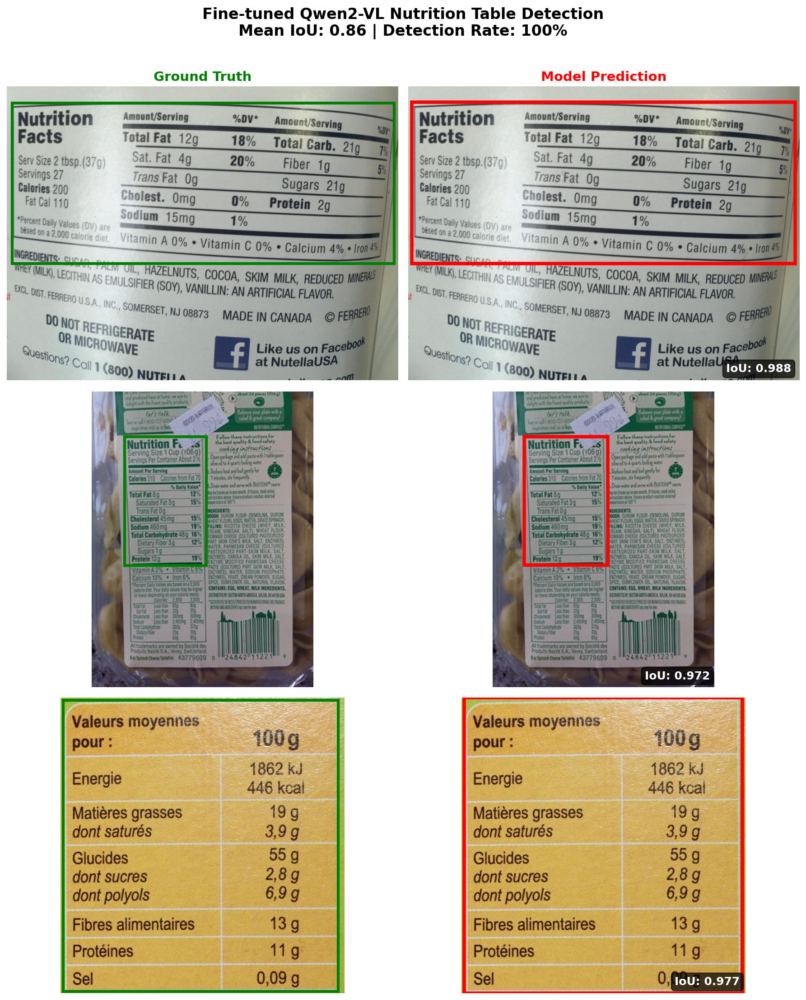
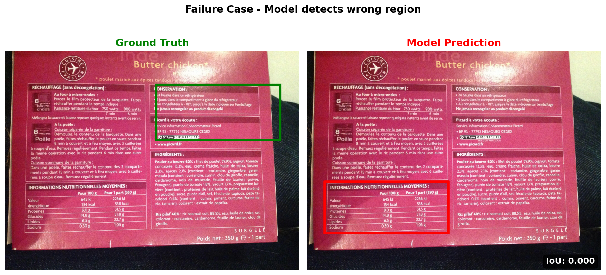
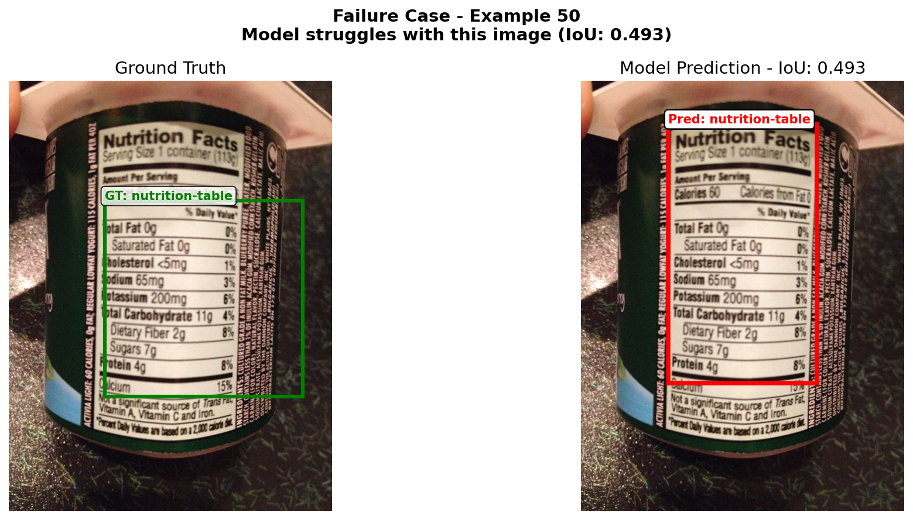

# Qwen2-VL Fine-tuning for Nutrition Table Detection

**Summary**: Nutrition facts tables appear in diverse layouts, orientations, and lighting conditions across food packaging. Extracting this information automatically requires first locating the table in the image. This project explores using a vision-language model ([Qwen2-VL-7B](https://huggingface.co/Qwen/Qwen2-VL-7B-Instruct)) for this task — fine-tuning it to output bounding box coordinates given a food packaging image, as an alternative to traditional object detection approaches (e.g., YOLO, Faster R-CNN). This project showcases the full pipeline from training (with four recipe strategies), GPTQ INT4 quantization, to production deployment via NVIDIA Triton Inference Server with vLLM backend.

> **Start Here**: Read [`fine_tuning_vlm_for_object_detection_trl.ipynb`](fine_tuning_vlm_for_object_detection_trl.ipynb) first. This notebook demonstrates the **entire pipeline** from data loading to training to evaluation to deployment. It contains the core logic that all other scripts are built upon. This is the recommended entry point for interviewers, hiring managers, and anyone who wants to learn about this project.

## Table of Contents

| Section | Description |
|---------|-------------|
| [Demo Results](#demo-results) | Visual examples of model predictions |
| [Quick Start](#-quick-start) | Get up and running in minutes |
| [Environment & Requirements](#-environment--requirements) | Dependencies, conda environments, setup |
| [Dataset](#-dataset) | Data source and format |
| [Training Configuration](#-training-configuration) | Model, hardware, and hyperparameter settings |
| [Training Recipes](#-training-recipes) | Four training strategies and commands |
| [Training Output Structure](#-training-output-structure) | Where training outputs are stored |
| [Model Preparation for Deployment](#-model-preparation-for-deployment) | Merge LoRA adapters and GPTQ quantization |
| [Serving (Standalone vLLM)](#-serving-standalone-vllm) | Local inference server without Docker |
| [Deployment (Triton)](#-deployment-triton-inference-server) | Production deployment with Docker |
| [Performance Results](#-performance-results) | Accuracy, latency, and throughput benchmarks |
| [Project Structure (Overview)](#-project-structure-overview) | Directory layout |
| [Project Structure (Detailed)](#-project-structure-detailed) | src/, scripts, and notebooks reference |
| [Troubleshooting](#-troubleshooting) | Common issues and fixes |

## Demo Results

**Fine-tuned model achieves 86% mean IoU with 100% detection rate** on nutrition table detection task.

### Success Cases (IoU > 0.97)



*Green (dashed): Ground Truth | Red (solid): Model Prediction*

### Failure Case Analysis

The model occasionally struggles with challenging images:

**Case 1: Model detects wrong region (IoU: 0.000)**



*The model detects a different nutrition table (bottom) instead of the annotated one (top left). This image has multiple table-like regions.*

**Case 2: Low IoU but potentially better prediction (IoU: 0.493)**



*Interestingly, the model's prediction may actually be more accurate than the ground truth annotation - highlighting that low IoU doesn't always mean wrong prediction and our model's performance is very strong!*

## 🚀 Quick Start

### 1. Clone and Create Environment
```bash
git clone <repo-url>
cd vlm_Qwen2VL_object_detection

# Create conda environment
conda env create -f environment.yml

conda activate vlm_Qwen2VL_object_detection
```

### 2. HuggingFace Token
```bash
# Set your HuggingFace token (needed for dataset and model downloads)
huggingface-cli login
```

### 3. Run Training

**Option A: Recipe-based training (recommended for production)**
```bash
# Run best-performing recipe (r4-joint) on GPUs 0,1
python scripts/train_recipe.py --recipe r4-joint --gpu 0,1

# With logging
python scripts/train_recipe.py --recipe r4-joint --gpu 0,1 2>&1 | tee r4-joint.log
```

**Option B: Interactive notebook (recommended for learning)**
```bash
jupyter notebook fine_tuning_vlm_for_object_detection_trl.ipynb
# Open the notebook and run all cells for the complete pipeline
```

## 📦 Environment & Requirements

This project uses two conda environments:

| Environment | Primary Use | Notes |
|-------------|-------------|-------|
| `vlm_Qwen2VL_object_detection` | Training, notebook development, refactor scripts | Main dev/training environment (`environment.yml`) |
| `qwen2vl_nutrition_vllm_serving` | GPTQ quantization, standalone vLLM serving, serving benchmarks | Defined by `environment_vllm_serving.yml`; local path reference: `/ssd1/zhuoyuan/envs/qwen2vl_nutrition_vllm_serving` |

### Training Environment

| Component | Version/File |
|-----------|--------------|
| **Python** | 3.10.18 |
| **Portable env** | `environment.yml` (no builds, cross-platform) |
| **Exact snapshot** | `environment.lock.yml` (with builds, reproducible) |
| **Pip packages** | `requirements.txt` |

#### Key Dependencies
- `transformers` (git HEAD) - HuggingFace transformers
- `trl` (git HEAD, ~0.22.0.dev0) - TRL training library with `completion_only_loss`
- `peft==0.17.1` - LoRA/QLoRA
- `bitsandbytes==0.47.0` - 4-bit quantization
- `torch==2.4.1+cu121` - PyTorch with CUDA 12.1

### Recreate Training Environment
```bash
# From portable export (recommended)
conda env create -f environment.yml

# From exact snapshot (same platform only)
conda env create -f environment.lock.yml
```

### Recreate vLLM Serving Environment
```bash
# Create serving/quantization environment from export
conda env create -f environment_vllm_serving.yml

# Activate by environment name (recommended, portable)
conda activate qwen2vl_nutrition_vllm_serving

# Optional local path activation (machine-specific personal reference)
conda activate /ssd1/zhuoyuan/envs/qwen2vl_nutrition_vllm_serving
```

<details>
<summary><strong>⚠️ TRL Version Note</strong></summary>

This project uses **TRL ~0.22.0.dev0** (git-based) with the new `completion_only_loss` parameter:

```python
from trl import SFTConfig, SFTTrainer

training_args = SFTConfig(
    completion_only_loss=True,  # Train only on assistant responses
    # other args...
)

trainer = SFTTrainer(
    model=model,
    args=training_args,
    # No need for DataCollatorForCompletionOnlyLM anymore
)
```

> **Note**: The old `DataCollatorForCompletionOnlyLM` from TRL 0.10.1 is no longer needed. The TRL team integrated completion-only functionality directly into the trainer.

</details>

## 📁 Project Files - Training

- `fine_tuning_vlm_for_object_detection_trl.ipynb` - **Comprehensive educational notebook** covering the full pipeline: data loading, preprocessing, model setup, training, evaluation, and deployment
- `scripts/train_recipe.py` - **Production training script** for running different recipes
- `notebooks/` - **Topic-specific educational notebooks** (EDA, model understanding, evaluation, etc.)
- `environment.yml`, `requirements.txt` - Training environment (see [Environment & Requirements](#-environment--requirements))

## 📊 Dataset

Using nutrition table detection dataset from HuggingFace:
- **Source**: OpenFoodFacts nutrition-table-detection
- **Training samples**: ~1083
- **Task**: Detect bounding boxes of nutrition tables
- **Format**: Conversation-style with user prompts and assistant responses

## 🔧 Training Configuration

### Model
- **Base**: Qwen2-VL-7B-Instruct
- **Quantization**: 4-bit NF4 with BitsAndBytes
- **Fine-tuning**: LoRA (r=64, alpha=128)
- **Training**: Completion-only loss on assistant responses

### Hardware
- **Tested on**: 2x NVIDIA RTX 6000 Ada (48GB VRAM each, 96GB total)
- **Multi-GPU**: Supported via device_map="balanced" (model parallelism)

### Key Hyperparameters
- **Batch Size**: 2 per device
- **Gradient Accumulation**: 8 steps
- **Learning Rate**: 1e-5 to 2e-5 with cosine schedule
- **Epochs**: 3
- **LoRA Rank**: 64 (higher for vision tasks)
- **LoRA Alpha**: 128
- **Max Length**: 2048 tokens

### Experiment Tracking

This project uses [Weights & Biases](https://wandb.ai/) for experiment tracking.
```bash
wandb login
```

## 🧪 Training Recipes

**Entry point**: `scripts/train_recipe.py`

Four training approaches have been implemented and evaluated:

| Recipe | Strategy | Mean IoU | Detection Rate | IoU>0.5 | IoU>0.7 |
|--------|----------|----------|----------------|---------|---------|
| Base (no fine-tuning) | - | 0.0981 | 18.00% | 10.00% | 6.00% |
| r1-llm-only | 4-bit + LoRA on LLM | 0.8349 | 100.00% | 86.00% | 82.00% |
| r2-vision-only | bf16 full fine-tune vision | 0.8330 | 100.00% | 88.00% | 82.00% |
| r3-two-stage | Vision first, then LLM LoRA | 0.8366 | 100.00% | 90.00% | 80.00% |
| **r4-joint** | **4-bit + LoRA on both** | **0.8636** | **100.00%** | **92.00%** | **88.00%** |

**Best performer: r4-joint** with 0.8636 mean IoU (+780% improvement over base model)

### Training Commands

```bash
# Run r1-llm-only on GPUs 0,1
python scripts/train_recipe.py --recipe r1-llm-only --gpu 0,1

# Run r2-vision-only on GPUs 2,3
python scripts/train_recipe.py --recipe r2-vision-only --gpu 2,3

# Run r4-joint on GPUs 4,5
python scripts/train_recipe.py --recipe r4-joint --gpu 4,5

# Run r3-two-stage (runs both stages sequentially)
python scripts/train_recipe.py --recipe r3-two-stage --gpu 6,7

# Disable W&B logging
python scripts/train_recipe.py --recipe r4-joint --gpu 0,1 --no-wandb

# With logging to file (using tee)
python scripts/train_recipe.py --recipe r4-joint --gpu 0,1 2>&1 | tee r4-joint_$(date +%Y%m%d_%H%M%S).log
```

### Run Multiple Recipes in Parallel
```bash
# Terminal 1
python scripts/train_recipe.py --recipe r1-llm-only --gpu 0,1

# Terminal 2
python scripts/train_recipe.py --recipe r2-vision-only --gpu 2,3

# Terminal 3
python scripts/train_recipe.py --recipe r4-joint --gpu 4,5
```

## 📁 Training Output Structure

Running `scripts/train_recipe.py` creates outputs in `/ssd1/zhuoyuan/vlm_outputs/`:

```
/ssd1/zhuoyuan/vlm_outputs/
├── qwen2vl-nutrition-detection-r1-llm-only/      # r1 recipe output
│   ├── checkpoint-*/                              # Intermediate checkpoints
│   ├── adapter_model.safetensors                  # LoRA adapter weights
│   ├── adapter_config.json                        # LoRA config
│   └── processor files...
├── qwen2vl-nutrition-detection-r2-vision-only/   # r2 recipe output (full model)
├── qwen2vl-nutrition-detection-r3-stage1/        # r3 Stage 1: vision training
├── qwen2vl-nutrition-detection-r3-stage2/        # r3 Stage 2: LLM from stage1
├── qwen2vl-nutrition-detection-r4-joint/         # r4 recipe output
├── qwen2vl-nutrition-detection-lora/             # Legacy: main notebook output
├── qwen2vl-nutrition-detection-merged/           # Optional: merged full model
└── logs/                                          # TensorBoard logs

/ssd1/zhuoyuan/hf_cache/                          # Model downloads (cached)
```

**Note**: r3-two-stage creates two outputs (`-r3-stage1` and `-r3-stage2`) because it runs sequentially.

**Storage Strategy**: All large files on SSD to preserve home directory quota (~100GB).

## 🔨 Model Preparation for Deployment

After training, prepare the model for deployment by merging LoRA adapters and optionally quantizing.

### Step 1: Merge LoRA Adapters

Training produces LoRA adapter weights. Merge them into the base model to create a standalone model:

```bash
# Merge r4-joint LoRA adapter into base Qwen2-VL-7B
python scripts/merge_lora.py \
    --adapter-path /ssd1/zhuoyuan/vlm_outputs/qwen2vl-nutrition-detection-r4-joint \
    --output-path /ssd1/zhuoyuan/vlm_outputs/qwen2vl-nutrition-detection-r4-joint-merged
```

This creates a full BF16 model (~15.5 GB) that can be served directly without PEFT dependencies.

### Step 2: GPTQ INT4 Quantization (Optional)

Quantize the merged model for faster inference and lower VRAM usage:

```bash
# Quantization environment (contains vLLM + GPTQModel)
conda activate qwen2vl_nutrition_vllm_serving
# Optional local path activation (machine-specific): conda activate /ssd1/zhuoyuan/envs/qwen2vl_nutrition_vllm_serving

# Verify GPTQModel is installed
python -c "import gptqmodel; print('gptqmodel is available')"
# If missing:
# pip install "gptqmodel>=2.2.0"

python scripts/quantize_model_gptq.py \
    --model-path /ssd1/zhuoyuan/vlm_outputs/qwen2vl-nutrition-detection-r4-joint-merged \
    --output-path /ssd1/zhuoyuan/vlm_outputs/qwen2vl-nutrition-detection-r4-joint-merged-gptq-int4 \
    --num-calibration-samples 128
```

- Quantizes only the LLM portion (vision encoder stays BF16 for accuracy)
- Uses multimodal calibration data (images + text from training set)
- Outputs `gptq_marlin` compatible format for vLLM
- Result: ~6.5 GB model, ~1.7x faster inference than BF16

## 🖥️ Serving (Standalone vLLM)

For quick local serving without Docker or Triton, use vLLM directly:

```bash
conda activate qwen2vl_nutrition_vllm_serving
# Optional local path activation (machine-specific): conda activate /ssd1/zhuoyuan/envs/qwen2vl_nutrition_vllm_serving

# Serve BF16 model
python scripts/serve_vllm.py --gpu 0

# Serve GPTQ INT4 model
python scripts/serve_vllm.py --gpu 0 \
    --model /ssd1/zhuoyuan/vlm_outputs/qwen2vl-nutrition-detection-r4-joint-merged-gptq-int4 \
    --quantization gptq_marlin --dtype float16

# With custom settings
python scripts/serve_vllm.py --gpu 0 \
    --port 8000 \
    --gpu-memory-utilization 0.9 \
    --no-enable-prefix-caching
```

Once the server is running, send requests via the OpenAI-compatible API:

```bash
curl http://localhost:8000/v1/chat/completions \
    -H "Content-Type: application/json" \
    -d '{
        "model": "qwen2vl-nutrition",
        "messages": [{"role": "user", "content": [
            {"type": "image_url", "image_url": {"url": "data:image/jpeg;base64,<IMAGE_B64>"}},
            {"type": "text", "text": "Detect the nutrition facts table in this image and return its bounding box coordinates."}
        ]}],
        "temperature": 0,
        "max_tokens": 100
    }'
```

## 🚢 Deployment (Triton Inference Server)

The fine-tuned model can be deployed as a production inference server using NVIDIA Triton with vLLM backend. A Dockerfile is provided for reproducible deployment.

### Prerequisites

- Docker with GPU support ([NVIDIA Container Toolkit](https://docs.nvidia.com/datacenter/cloud-native/container-toolkit/latest/install-guide.html))
- GPU with 8GB+ VRAM for GPTQ INT4, or 16GB+ for BF16
- Model weights (download from HuggingFace — see below)

### Quick Start

```bash
# 1. Build the Docker image
docker build -t qwen2vl-triton .

# 2. Download model weights from HuggingFace (requires Git LFS)
git lfs install
#    GPTQ INT4 (~6.5 GB):
git clone https://huggingface.co/<org>/qwen2vl-nutrition-detection-r4-joint-merged-gptq-int4 /path/to/gptq-weights
#    BF16 full-precision (~15.5 GB):
git clone https://huggingface.co/<org>/qwen2vl-nutrition-detection-r4-joint-merged /path/to/bf16-weights

# 3. Start the inference server (GPTQ INT4 — faster, recommended)
docker run --gpus all --rm -d --shm-size=4G \
    -p 8000:8000 -p 8001:8001 -p 8002:8002 \
    -v /path/to/gptq-weights:/models/qwen2vl-nutrition-detection-r4-joint-merged-gptq-int4:ro \
    qwen2vl-triton gptq

# 4. Verify the server is running
curl http://localhost:8000/v2/health/live
```

### Model Options

| Argument | Model | VRAM | Latency (P50) | Use Case |
|----------|-------|------|---------------|----------|
| `gptq` (default) | GPTQ INT4 | ~6.5 GB | ~310 ms | Production (faster) |
| `bf16` | BF16 full-precision | ~15.5 GB | ~538 ms | Accuracy baseline |
| `both` | Both models | ~22 GB (2 GPUs) | — | A/B testing |

### Sending Inference Requests

```bash
# Encode an image to base64
IMAGE_B64=$(base64 -w0 test_image.jpg)          # Linux (GNU coreutils)
# IMAGE_B64=$(base64 < test_image.jpg | tr -d '\n')  # macOS

# Send request to /generate using the typed "inputs" payload used in
# scripts/validate_triton_accuracy.py and triton_model_repository/README.md
curl -X POST http://localhost:8000/v2/models/qwen2vl_nutrition_gptq_int4/generate \
  -H "Content-Type: application/json" \
  -d @- <<JSON
{
  "inputs": [
    {
      "name": "text_input",
      "shape": [1],
      "datatype": "BYTES",
      "data": ["Detect the nutrition facts table."]
    },
    {
      "name": "image",
      "shape": [1],
      "datatype": "BYTES",
      "data": ["${IMAGE_B64}"]
    },
    {
      "name": "sampling_parameters",
      "shape": [1],
      "datatype": "BYTES",
      "data": ["{\"temperature\": 0, \"max_tokens\": 100}"]
    },
    {
      "name": "stream",
      "shape": [1],
      "datatype": "BOOL",
      "data": [false]
    }
  ]
}
JSON
```

### Ports

| Port | Protocol | Purpose |
|------|----------|---------|
| 8000 | HTTP | REST API (`/v2/models/{name}/generate`) |
| 8001 | gRPC | gRPC API |
| 8002 | HTTP | Prometheus metrics |

### How It Works

The `Dockerfile` extends `nvcr.io/nvidia/tritonserver:26.01-vllm-python-py3` and bakes in the model configs (`config.pbtxt` + `model.json`). At runtime, `docker/entrypoint.sh` copies the selected model's config into Triton's model repository and starts the server. Model weights are mounted via `-v` (not included in the image due to size).

For detailed deployment documentation, see [`refactor_documentation/PROGRESS_20260206_SESSION32.md`](refactor_documentation/PROGRESS_20260206_SESSION32.md).

### Triton Model Repository

```
triton_model_repository/
├── README.md                              # Deployment guide and path mapping
├── PATH_MAPPING.md                        # Host → Cloud → Container path reference
│
├── qwen2vl_nutrition_gptq_int4/           # GPTQ INT4 model (~6.5 GB, ~310ms P50)
│   ├── config.pbtxt                       # Triton API contract (inputs, outputs, decoupled mode)
│   └── 1/
│       └── model.json                     # vLLM engine config (model path, dtype, tokenizer)
│
└── qwen2vl_nutrition_bf16/                # BF16 full-precision model (~15.5 GB, ~538ms P50)
    ├── config.pbtxt
    └── 1/
        └── model.json
```

- `config.pbtxt` defines Triton's API: input/output tensors, `decoupled: true` for vLLM streaming protocol, `KIND_MODEL` instance group
- `model.json` passes all keys directly to vLLM's `AsyncEngineArgs`: model path, dtype, quantization, tokenizer settings

### Running Benchmarks

Benchmarks run on the **host machine** (not inside Docker). Install client-side dependencies first:

```bash
pip install -r requirements_triton_benchmark.txt --extra-index-url https://download.pytorch.org/whl/cpu
```

Then run:

```bash
# GPTQ INT4: concurrency=1, 20 requests, varied images (unbiased)
python scripts/benchmark_triton.py \
    --model qwen2vl_nutrition_gptq_int4 \
    --concurrency 1 --num-requests 20 --vary-images

# BF16: same settings
python scripts/benchmark_triton.py \
    --model qwen2vl_nutrition_bf16 \
    --concurrency 1 --num-requests 20 --vary-images
```

## 📈 Performance Results

### Training Accuracy

Based on evaluation of a 50-sample validation slice (HuggingFace inference):

| Metric | r4-joint (Best) |
|--------|-----------------|
| **Mean IoU** | 0.8636 |
| **Median IoU** | 0.89 |
| **Detection Rate** | 100% |
| **IoU > 0.5** | 92% |
| **IoU > 0.7** | 88% |

### Serving Accuracy (vLLM, 100 validation samples)

| Metric | BF16 | GPTQ INT4 | Drift |
|--------|------|-----------|-------|
| **Mean IoU** | 0.846 | 0.840 | -0.7% |
| **Detection Rate** | 100% | 100% | — |
| **IoU > 0.5** | — | 91% | — |
| **IoU > 0.7** | — | 86% | — |

GPTQ INT4 quantization has minimal accuracy loss (<1% IoU drift) compared to BF16.

### Inference Latency and Throughput

**Triton Inference Server on RTX 4090** (unbiased: varied images, prefix caching disabled):

| Model | Concurrency | P50 Latency | Throughput |
|-------|-------------|-------------|------------|
| GPTQ INT4 | c=1 | 470 ms | 1.65 req/s |
| GPTQ INT4 | c=4 | 1,013 ms | 3.94 req/s |
| BF16 | c=1 | 703 ms | 1.19 req/s |
| BF16 | c=4 | 1,236 ms | 3.23 req/s |

**Standalone vLLM on RTX 3090** (unbiased, no prefix caching):

| Model | Concurrency | P50 Latency | Throughput |
|-------|-------------|-------------|------------|
| BF16 | c=1 | 907 ms | 1.09 req/s |
| BF16 | c=8 | 2,138 ms | 3.17 req/s |

**Key takeaways:**
- GPTQ INT4 is ~1.5x faster than BF16 at P50 latency (470ms vs 703ms)
- RTX 4090 is ~1.7x faster than RTX 3090 for the same model
- Higher concurrency increases throughput but also per-request latency
- Triton accuracy (mean IoU) not yet verified — pending (expected to be close to standalone vLLM; we plan to validate with `scripts/validate_triton_accuracy.py`)

## 🏗️ Project Structure (Overview)

```
vlm_Qwen2VL_object_detection/
├── Dockerfile                    # Triton deployment image (see Deployment section)
├── docker/
│   └── entrypoint.sh             # Model selection + Triton startup script
├── src/                          # Modular source code
│   ├── data/                     # Dataset preparation & collation
│   ├── models/                   # Model loading & configuration
│   ├── training/                 # Training utilities & evaluation
│   └── utils/                    # GPU management & visualization
├── scripts/                      # Training & deployment scripts
│   ├── train.py                  # Simple single-config training
│   ├── train_recipe.py           # Flexible recipe-based training (recommended)
│   ├── run_recipes.sh            # Bash wrapper for train_recipe.py
│   ├── benchmark_triton.py       # Triton HTTP benchmark (async)
│   ├── benchmark_vllm.py         # Standalone vLLM benchmark
│   └── serve_vllm.py             # Standalone vLLM serving wrapper
├── triton_model_repository/      # Triton Inference Server configs
│   ├── qwen2vl_nutrition_gptq_int4/  # GPTQ INT4 model config
│   │   ├── config.pbtxt
│   │   └── 1/model.json
│   └── qwen2vl_nutrition_bf16/       # BF16 model config
│       ├── config.pbtxt
│       └── 1/model.json
├── tests/                        # Test suite
│   ├── test_data_format_before_chat_template.py
│   └── test_golden_output.py
├── notebooks/                    # Educational notebooks (topic-specific deep dives)
│   ├── 01_dataset_exploration.ipynb
│   ├── 02_model_understanding.ipynb
│   ├── 03_data_preprocessing.ipynb
│   ├── 04_evaluation_analysis.ipynb
│   ├── 05_debug_dtype_issue.ipynb
│   ├── 06_quantization_and_trainable_params.ipynb
│   ├── 07_deployment_vllm_triton.ipynb
│   ├── 08_vllm_performance_analysis.ipynb
│   ├── 09_vllm_memory_experiments.ipynb
│   ├── 10_Triton.ipynb
│   ├── debug_repetition_bug.ipynb
│   └── generate_golden_test_data.ipynb
└── refactor_documentation/       # Development history (33 sessions)
```

## 📂 Project Structure (Detailed)

## src/ Folder (Detailed)

### `src/data/`
| File | Description |
|------|-------------|
| `dataset.py` | Convert raw data to conversation format with image placeholders |
| `collators.py` | Batch collation: `AllTokensCollator`, `AssistantOnlyCollator` |

### `src/models/`
| File | Description |
|------|-------------|
| `loader.py` | Load Qwen2-VL with 4-bit quantization and device_map |
| `lora.py` | LoRA config (r=64, alpha=128) and target modules |
| `inference.py` | Single image inference and bbox output parsing |

### `src/training/`
| File | Description |
|------|-------------|
| `config.py` | SFTConfig creation and training variants |
| `evaluation.py` | IoU-based evaluation metrics |
| `callbacks.py` | *(LEGACY)* Flash attention debug callbacks, not currently used |

### `src/utils/`
| File | Description |
|------|-------------|
| `gpu.py` | Auto-detect GPUs, setup CUDA_VISIBLE_DEVICES |
| `visualization.py` | Plotting and visualization helpers |
| `debug.py` | Debugging utilities |

## 📜 Scripts Folder

> See [`scripts/README.md`](scripts/README.md) for detailed per-script documentation.

### Training

| Script | Purpose | When to Use |
|--------|---------|-------------|
| `train_recipe.py` | Flexible recipe-based training with CLI args | **Recommended** for all training runs |
| `train.py` | Simple training script (~150 lines) with hardcoded config | Learning the codebase, quick experiments |
| `run_recipes.sh` | Bash wrapper with simpler syntax | Convenience for running recipes |

### Model Preparation

| Script | Purpose | When to Use |
|--------|---------|-------------|
| `merge_lora.py` | Merge LoRA adapters into base model | Before deployment or quantization |
| `quantize_model_gptq.py` | GPTQ INT4 quantization of merged model | Creating quantized model for faster inference (requires `gptqmodel>=2.2.0`) |

### Serving & Deployment

| Script | Purpose | When to Use |
|--------|---------|-------------|
| `serve_vllm.py` | Start standalone vLLM OpenAI-compatible server | Local development, standalone serving |
| `deploy_triton.sh` | Start Triton via Docker with pre-flight checks | Alternative to Dockerfile for manual deployment |
| `setup_triton.py` | Generate Triton config files from CLI args | Initial config generation (configs now maintained by hand in `triton_model_repository/`) |

### Benchmarking & Evaluation

| Script | Purpose | When to Use |
|--------|---------|-------------|
| `benchmark_vllm.py` | Benchmark standalone vLLM (latency, throughput, concurrency sweeps) | Evaluating vLLM serving performance |
| `benchmark_triton.py` | Benchmark Triton HTTP `/generate` endpoint (async, concurrency) | Evaluating Triton deployment performance |
| `benchmark_hf_baseline.py` | Benchmark HuggingFace Transformers baseline (static batching) | Comparing against vLLM/Triton |
| `evaluate_vllm_accuracy.py` | Evaluate vLLM accuracy with IoU metrics on validation set | Accuracy evaluation after deployment |
| `establish_baseline.py` | Establish baseline accuracy for quantization comparison | Before/after quantization comparison |
| `validate_triton_accuracy.py` | Validate Triton deployment produces correct outputs | Sanity check after Triton deployment |

### Quick Tests

| Script | Purpose | When to Use |
|--------|---------|-------------|
| `quick_test_vllm_api.py` | Send 1 request to vLLM, print raw output | Smoke test: is the server responding? |
| `quick_test_vllm_with_visualization.py` | Send 1 request + parse bbox + draw on image | Smoke test with visual verification |

### Common Workflows

| Task | One-liner |
|------|-----------|
| Train best recipe (r4-joint) | `python scripts/train_recipe.py --recipe r4-joint --gpu 0,1` |
| Merge LoRA adapter to standalone BF16 model | `python scripts/merge_lora.py --adapter-path <adapter_dir> --output-path <merged_dir>` |
| Quantize merged model to GPTQ INT4 | `python scripts/quantize_model_gptq.py --model-path <merged_dir> --output-path <gptq_dir>` |
| Start standalone vLLM server | `python scripts/serve_vllm.py --gpu 0 --port 8000` |
| Quick API sanity check | `python scripts/quick_test_vllm_api.py` |
| Benchmark standalone vLLM | `python scripts/benchmark_vllm.py --port 8000 --num-requests 20 --concurrency 8 --vary-images` |
| Benchmark Triton | `python scripts/benchmark_triton.py --model qwen2vl_nutrition_gptq_int4 --endpoint http --num-requests 20 --concurrency 4 --vary-images` |
| Validate Triton vs baseline | `python scripts/validate_triton_accuracy.py --model qwen2vl_nutrition_gptq_int4 --baseline <bf16_baseline.json>` |

## 📓 Notebook Folder

| Notebook | Focus | Prerequisites | Run All |
|----------|-------|---------------|---------|
| `notebooks/01_dataset_exploration.ipynb` | Dataset EDA and sample inspection | Dev/training env | Yes |
| `notebooks/02_model_understanding.ipynb` | Qwen2-VL architecture walkthrough | Dev/training env | Yes |
| `notebooks/03_data_preprocessing.ipynb` | Data formatting and chat-template pipeline | Dev/training env | Yes |
| `notebooks/04_evaluation_analysis.ipynb` | Evaluation metrics and IoU interpretation | Dev/training env + result files | Yes |
| `notebooks/05_debug_dtype_issue.ipynb` | Dtype/device debugging notes | Dev/training env | Yes |
| `notebooks/06_quantization_and_trainable_params.ipynb` | Quantization concepts and trainable parameter checks | Dev/training env | Yes |
| `notebooks/07_deployment_vllm_triton.ipynb` | Step-by-step vLLM/Triton deployment walkthrough | vLLM server for runnable vLLM cells; Triton/Docker optional for Triton cells | Partial |
| `notebooks/08_vllm_performance_analysis.ipynb` | vLLM benchmark analysis and metric interpretation | Benchmark result files + (optional) running vLLM server | Partial |
| `notebooks/09_vllm_memory_experiments.ipynb` | vLLM memory/concurrency experiments | Running vLLM server; GPU access | Partial |
| `notebooks/10_Triton.ipynb` | Triton deployment and serving walkthrough | Triton server (usually Docker) | Partial |
| `notebooks/debug_repetition_bug.ipynb` | Debug diary for output repetition bug | Dev/training env | Yes |
| `notebooks/generate_golden_test_data.ipynb` | Generate golden test data for test fixtures | Dev/training env | Yes |

## 🔁 Notebook ⇄ Script Sync (Jupytext)

> **Note**: Replace paths below with your project location.

- One-time pairing (sets formats on the notebook):
  ```bash
  jupytext --set-formats ipynb,py:percent /home/zhuoyuan/projects/vlm_Qwen2VL_object_detection/fine_tuning_vlm_for_object_detection_trl.ipynb
  ```

- Ongoing sync (both directions; updates the older file from the newer one):
  ```bash
  jupytext --sync /home/zhuoyuan/projects/vlm_Qwen2VL_object_detection/fine_tuning_vlm_for_object_detection_trl.ipynb | cat
  ```

- Directional sync (optional control):
  - ipynb → py
    ```bash
    jupytext --to py:percent /home/zhuoyuan/projects/vlm_Qwen2VL_object_detection/fine_tuning_vlm_for_object_detection_trl.ipynb
    ```
  - py → ipynb
    ```bash
    jupytext --to ipynb /home/zhuoyuan/projects/vlm_Qwen2VL_object_detection/fine_tuning_vlm_for_object_detection_trl.py
    ```

## 🔍 Troubleshooting

| Issue | Solution |
|-------|----------|
| **CUDA OOM** | Reduce batch_size or enable gradient_checkpointing |
| **Dataset Access** | HF token should be set in ~/.bashrc |
| **dtype mismatch error** | Check device_map and DataParallel conflicts (see Session 20 docs) |
| **Evaluation showing 0% detection** | Add `gc.collect()` and `torch.cuda.empty_cache()` before loading models |
| **No test set available** | Dataset has train/val splits only — use the validation slice for evaluation |

## 📄 License

For educational purposes. Check individual licenses for Qwen2-VL model and datasets.

